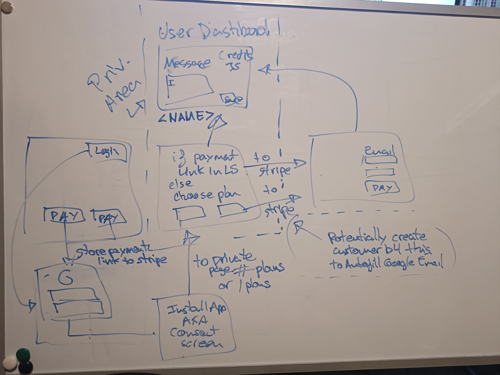

> DOD?: Cada version TIENE que aportar valor.

## v0

- 1 user, 1 calendar. Calendar ID matches user Gmail address.
- 2 pricing plans/products using Stripe
  - Free tier: number of tokens (30 for example). Do we also want to constrain on time?
  - Subscription vs top-up: Top-up poses a significant risk of forgetting to do it and not getting any notifycations to customers. So subscription. Plan specifics to be discussed. Exclusive usage to private area for beta testers. For not beta-testers, perhaps we want to keep the email address for mailing purposes. IDea: use private are as a testing area and promote tested features to public area as they get the "passed" stamp.

- Fixed 24-hour reminder.
- Reminders are sent from Notifycal's own Whatsapp business account.
- Google calendar integration (check diagram)
  - Search for events every hour (lambda schedule)
  - phone number coming from Google Contact in Calendar event
- Store custom notifycation message to use at send-time. 1 user == 1 calendar_id == 1 template.

## v1

- Engaging. Transform free-tier users into paid used.
