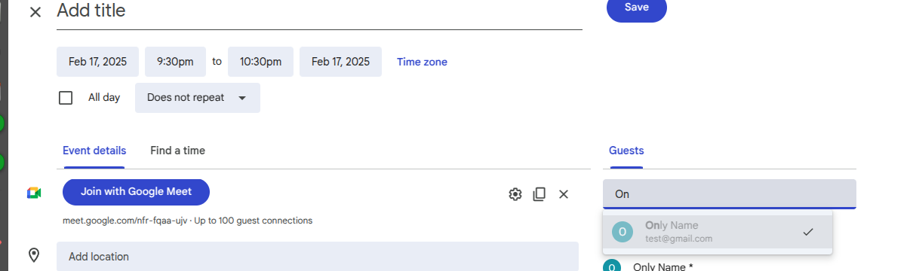
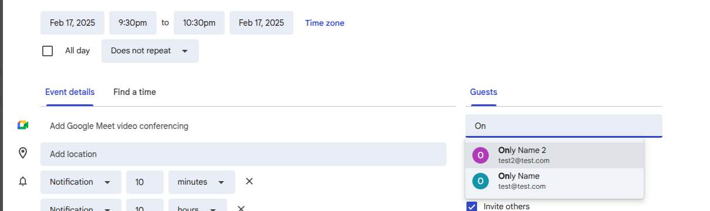
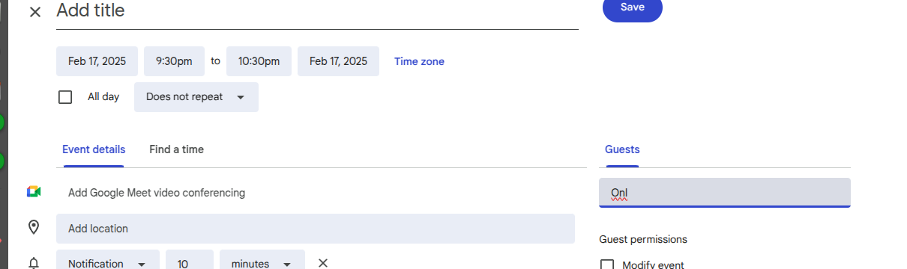

# Google Calendar & Contacts UI Limitations

## Overview

When using Google Calendar for event management, users may encounter several limitations in the user interface, particularly regarding how contacts can be added to events and how their information is managed. This document outlines these limitations and provides potential workarounds.

## Contact Addition Limitations

### Email-Only Contact Addition

One of the primary limitations of Google Calendar's interface is that it only allows adding contacts to events via email addresses. This creates several challenges:

- Contacts without email addresses cannot be properly added to events
- Searching for contacts by name is permitted, but only if they have an associated email address

Screenshot of Google Calendar UI trying to add a contact to an event 
Screenshot of Google Calendar UI trying to add a contact to an event 
Screenshot of Google Calendar UI trying to add a contact to an event 

### Telephone Number Management

Google Calendar does not provide a native way to:

- Add telephone numbers directly to event participants
- Search for contacts by telephone number
- Maintain telephone numbers for participants without email addresses

## Workarounds

### Client-Side Email Creation

A potential workaround is to have clients create a unique email address within their Google account that serves as an identifier. While not ideal, this approach:

- Allows the autocomplete function to work by name
- Creates a searchable-by-name record in Google Calendar
- Enables proper participant management

Note that this approach requires clients to take specific actions and may not be suitable for all use cases.

### Alternative Contact Management Solutions

For organisations requiring robust telephone number management for event participants, consider:

- Using dedicated CRM software that integrates with Google Calendar
- Implementing custom solutions that leverage Google Calendar API
- Storing contact information in a separate system with cross-references to Google Calendar events

## Best Practices

When working with Google Calendar's limitations:

1. **Inform users upfront** about the requirement for email addresses
2. **Create clear documentation** for your specific workflows
3. **Consider alternative fields** for storing telephone numbers (such as in event descriptions or notes)
4. **Establish consistent naming conventions** for contacts without genuine email addresses
5. **Regularly audit and update** contact information to maintain data integrity

## Technical Context

These limitations exist because Google Calendar was primarily designed around email-based communications rather than telephone-based interactions. The system's architecture assumes that primary contact method for event coordination will be email.

While Google continues to improve their services, these fundamental limitations in the user interface are likely to persist for the foreseeable future, as they are tied to the core design of the Google Workspace ecosystem.
