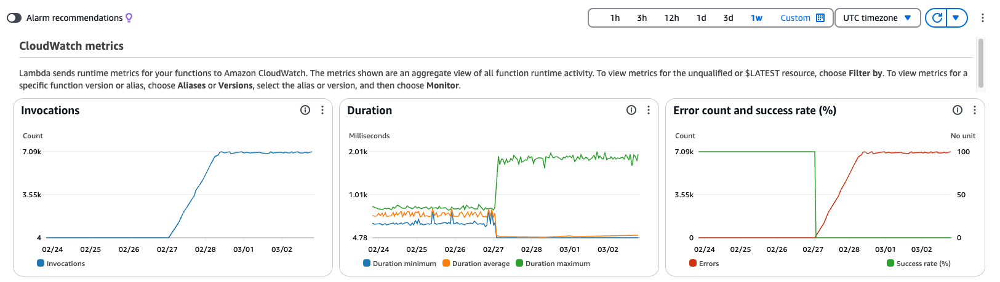
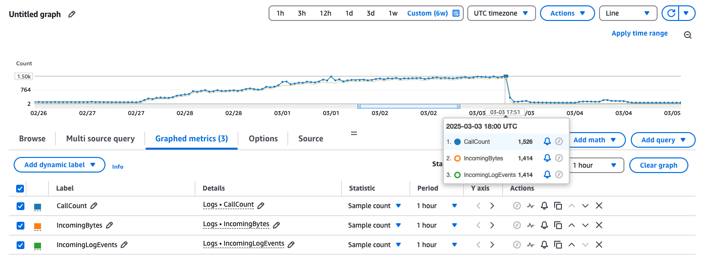

## 1. Incident Summary

|                         |                      |
| ----------------------- | :------------------: |
| Incident ID             |       20250303       |
| Incident Date and Time  | 03-03-2025 19:05 UTC |
| Reported by             |         Dan          |
| Affected System/service |     audit-trail      |

### Incident Description

While verifying that `audit-trail` was successfully processing a new `eventType`, we spotted an unusually high number of invocations (around 7k lambda invocations per hour) in the `audit-trail` Lambda.



**Expected vs. Actual Behavior**

- Expected behavior: The audit-trail Lambda should process EventBridge events successfully and avoid unnecessary re-invocations.
- Actual behavior: The audit-trail Lambda continuously retried due to schema validation failure, causing an invocation loop.

## 2. Impact Analysis

### - User Impact

N/A - Not live yet

### - Business Impact

Given that we're still actively developing the platform, the business impact was purely financial. The unusually high number of invocations caused an unusual number of "observability points" (Cloudwatch log entries, X-Ray traces, etc...) which increased the AWS bill on roughly $20 (tax excluded).



**Estimated total `audit-trail` Lambda invocations over the incident period**

- 7,000 invocations/hour x 117 hours roughly -> 819,000 total `audit-trail` Lambda invocations

### - Duration

27-02-2025 22:00 UTC (roughly) - 03-03-2025 19:07 UTC

### - Severity Level

High

## 3. Root Cause Analysis

### - Direct Cause

There was inconsistent data for a user in the `Users` DynamoDB table. This user's status was `live`, but it didn't have any associated `Config` and as such, accessing the `Config.calendars` property threw an error when trying to traverse the `calendars` array in the scheduled Lambda that starts the background processing, causing it to repeatedly fail and also send the failed events to `audit-trail`.

This is the error message that was causing the `audit-trail` Lambda to fail:

```
TypeError: Cannot read properties of undefined (reading 'calendars')
```

### - Root Cause

`audit-trail` was able to understand/succesfully validate schemas for our own created `eventType`s (`UserCalendarsFetched`, `ActionableEventFound`, etc...) but wasn't able to succesfully process the AWS EventBridge event from the scheduled lambda that starts the background processing.

This caused these events to be returned to the SQS queue, which immediately triggered the `audit-trail` Lambda again, causing an invocation loop that lasted several days, and had an increasing number of events as the Lambda causing the errors was still running every 30 minutes.

### - Contributing Factors

- Lack of alerting for an unusually high number of Lambda invocations (generally).
- Lack of alerting for an unusually high number of messages in the SQS queues connected to `audit-trail` (nor generally).
- No limit on the number of times that the same SQS message can be processed.

## 4. Timeline of Events

| Date time (UTC)  | Event Description                         |
| ---------------- | ----------------------------------------- |
| 27-02-2025 23:00 | Metrics show that issue started to happen |
| 03-03-2025 19:04 | **Issue detected**                        |
| 03-03-2025 19:05 | **Issue escalated (Slack)**               |
| 03-03-2025 19:07 | **First response action taken**           |
| 03-03-2025 20:34 | **Root cause identified**                 |
| 03-03-2025 21:00 | Second response action taken              |
| 04-03-2025 0:43  | Direct cause identified                   |
| 04-03-2025 0:45  | Third response action taken               |
|                  | Resolution applied                        |
|                  | Post-resolution monitoring                |

## 5. Resolution & Recovery

### - Actions Taken

- The first response action taken was to remove all the SQS triggers from the audit-trail Lambda.
- The second response action taken was to drop the messages piled up in the Lambda DLQ SQS queue.
- The third response action taken was to change the conflicting user `Status` to `onboarding` in the Users DynamoDB table.

### - Resolution Time

3 minutes from first spotting it to stop it from happening. But had been happening since the night of the 27th of March.

### - Verification Steps

The response actions taken were verified by ensuring that:

- The number of events/messages in the Lambda DLQ SQS queue was not increasing every 30 minutes.
- The number of invocations of the audit-trail Lambda decreased to regular levels.

## 6. Preventive Actions & Next Steps

### - Short-term Fixes - Immediate measures implemented

- [backend #416](https://github.com/Notifycal/backend/issues/416): Tweak audit-trail so it accepts events from the first Lambda (eventbridge)
- [backend #417](https://github.com/Notifycal/backend/issues/417): Fix fetch-user-calendars lambda

### - Long-term Preventive Actions - System/process improvements to prevent recurrence

- [backend #414](https://github.com/Notifycal/backend/issues/414): Alert when number of lambda invocations increases heavily
- [backend #415](https://github.com/Notifycal/backend/issues/415): Limit number of times we can try to process a SQS message

### - Timeline for Completion - Deadline for preventive actions

At the time of writing this document, both long-term preventative actions (#414 and #415) have been addressed.

## 7. Lessons Learned

### - Key Takeaways

We need to monitor and alert even before being live, because we don't want our AWS costs to increase unnecessarily.

### - Improvements for Future

- Establish a default "safety threshold" for Lambda retries.
- Set up automated alerts on SQS queue depth.
- Ensure future failures self-recover without intervention.
