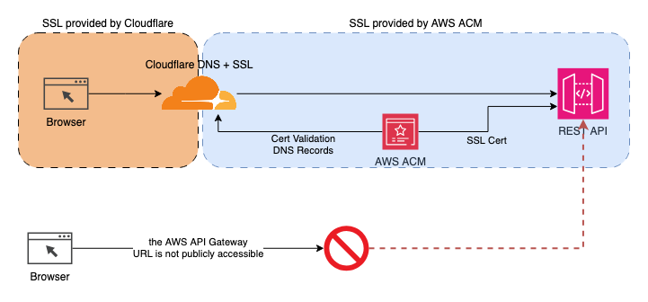

## What AWS does out of the box

When deploying a REST API in AWS API Gateway, they will provide a URL of the following shape to invoke the api:

```
https://<api-id>.execute-api.<region>.amazonaws.com/<stage>/
```

However, this URL ended up not being enough, because:

- Due to our API deployment setup with TF/TG, the API ID will change (maybe not every run, but almost). This means that every time that the API is deployed, we'll have to deploy the `frontend` too so it's aware of the change.
- Even while accepting the above, Cloudflare will cache the service discovery file we use `config.js` and can still point to the old API URL (provided by AWS).

Because of this, we decided to use a Custom Domain name for our API.

## Our setup



- Cloudflare provides SSL between the browser and themselves.
- AWS ACM provides SSL between Cloudflare and the API Gateway (AWS).
- The default API Gateway _execute-url_ cannot be used to invoke the API.
- Cloudflare handles the ACM Certificate validation through DNS records (provided by AWS, created in Cloudflare)
