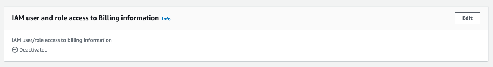
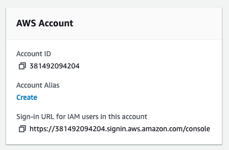
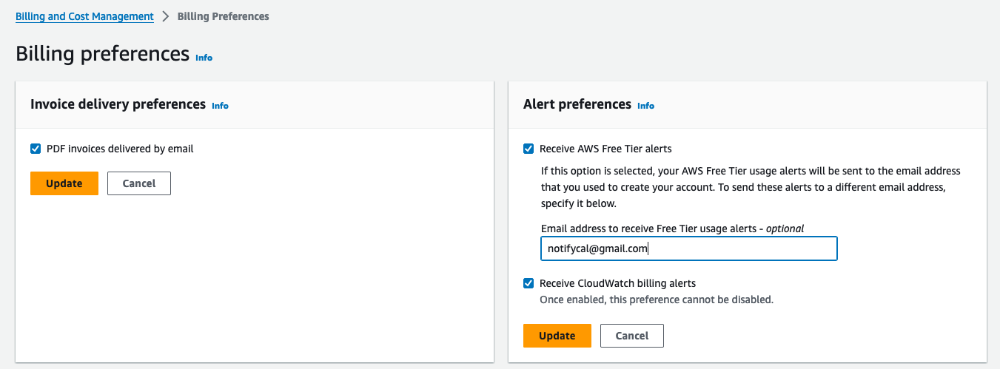
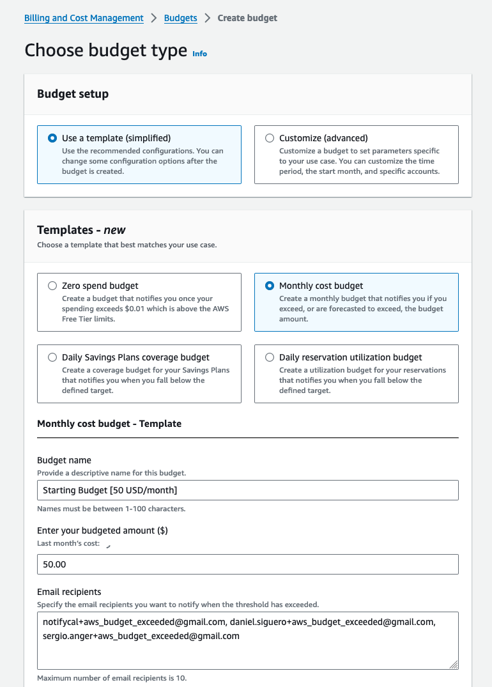
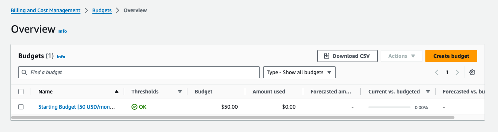

:::note
The following steps must be followed for all AWS accounts, regardless of whether they are for management or for environments.
:::

## AWS Account creation

1. Create an AWS account, following their wizard.
1. Enable MFA for the root user.
1. Enable IAM user and role access to Billing information. Go to "Account" then scroll down.
   
1. Setup an account alias if not done earlier. Go to `IAM > Dashboard` and click on `Create` below `Account Alias`.
   .
1. Save the Sign-in URL as it will be the entrypoint to the AWS Console (UI).

## Budgeting and cost notifications

Using the Root Account, you just need to:

1. Go to `Billing and Cost Management > Billing Preferences` and enable the following:
   a. `PDF invoices delivery by email`
   b. `Receive AWS Free Tier alerts`
   c. `Receive Cloudwatch billing alerts`
   
1. Create a cost budget.
     
   

## Create `iamadmin` Administrator user

1. Create a `iamadmin` IAM User
   a. Enable Console (UI) access.
   b. Give it the IAM Role `AdministratorAccess`.
1. Log in with it.
1. Enable MFA.

### [Optional] Enable programmatic access for `iamadmin`

1. Go to IAM > My Security credentials
1. Create Access key. Select CLI and check the box.
1. Click on `Create access key`.
1. Finally download the .csv file and save it somewhere safe.

## AWS CLI setup

Check how to [setup the AWS CLI](/guides/aws/00_aws_cli) and verify it works correctly before moving into the next step.

## Management account extra steps

:::caution
If the account is a management account, designed to be the entrypoint for access/impersonation, also follow the steps outlined [here](../05_aws_account_setup_mgmt).
:::
