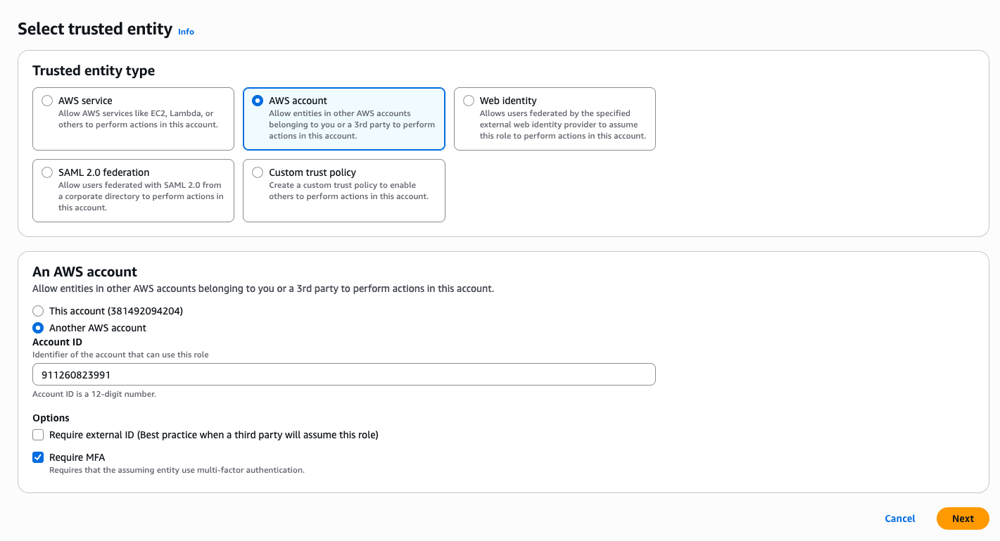
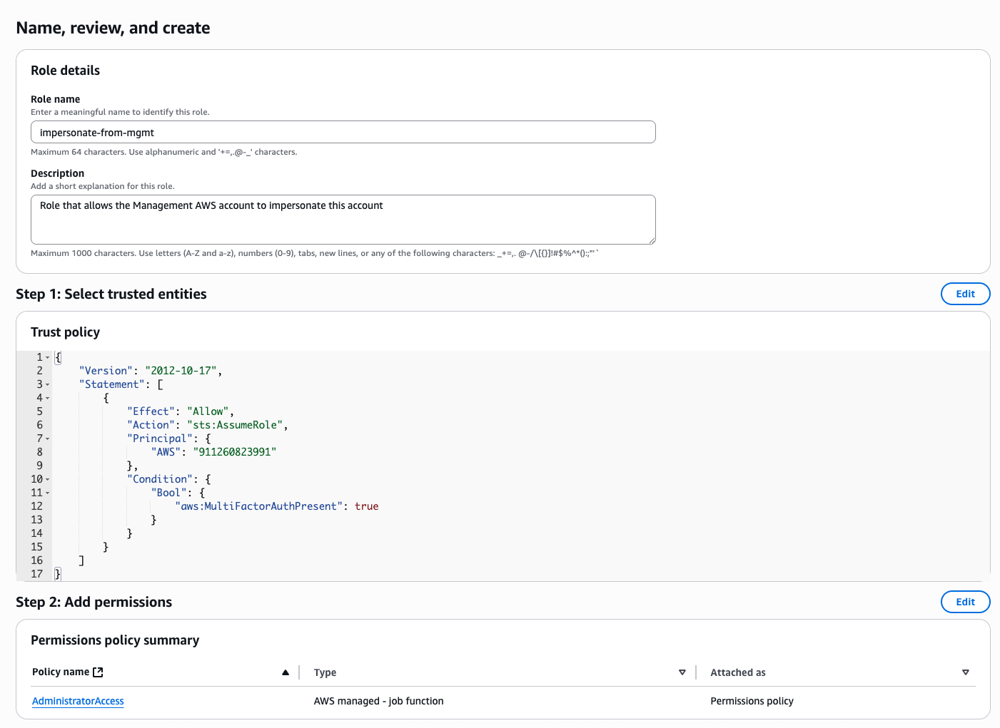
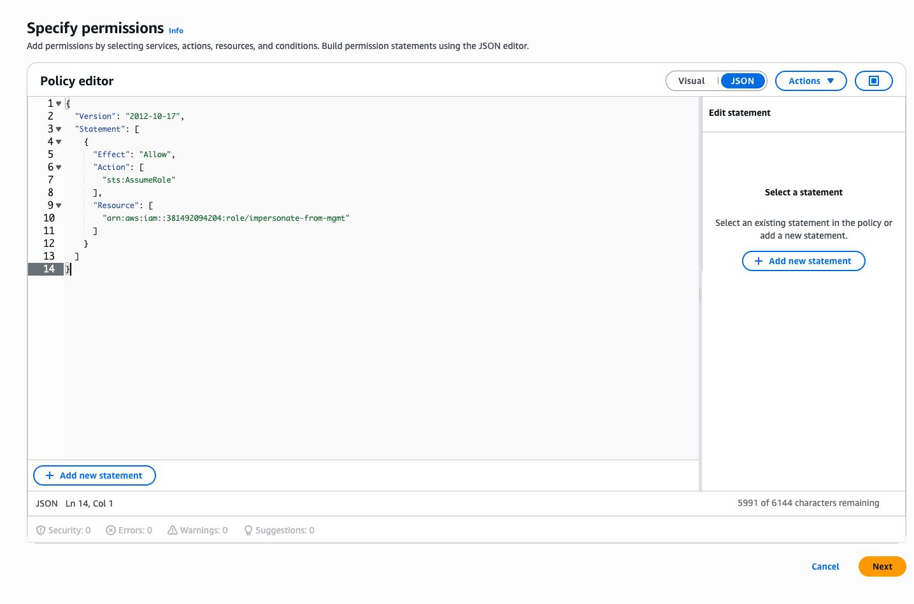
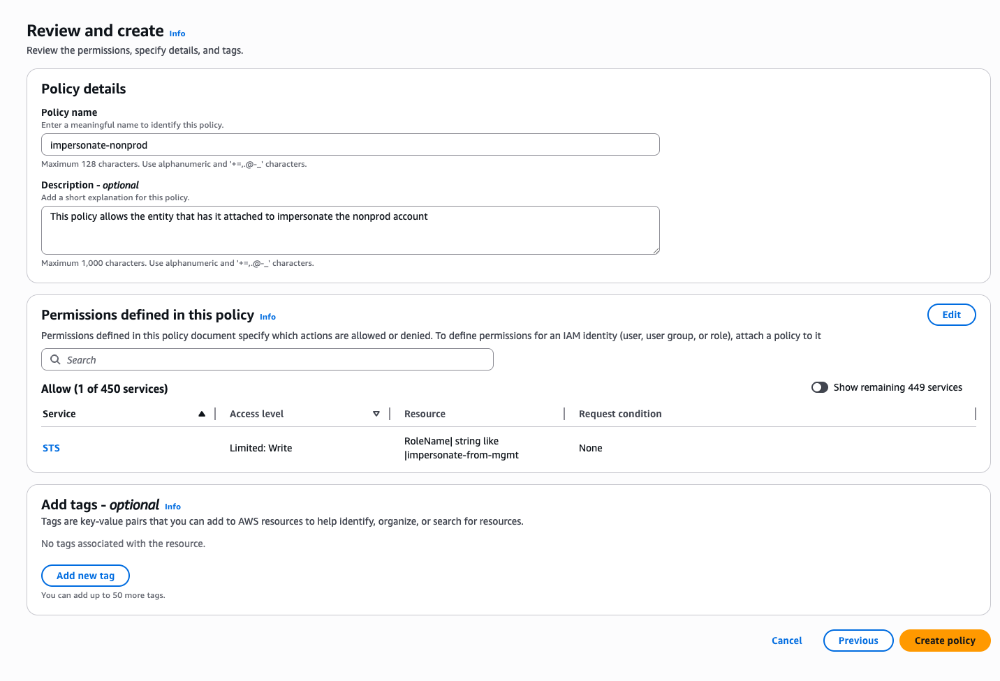
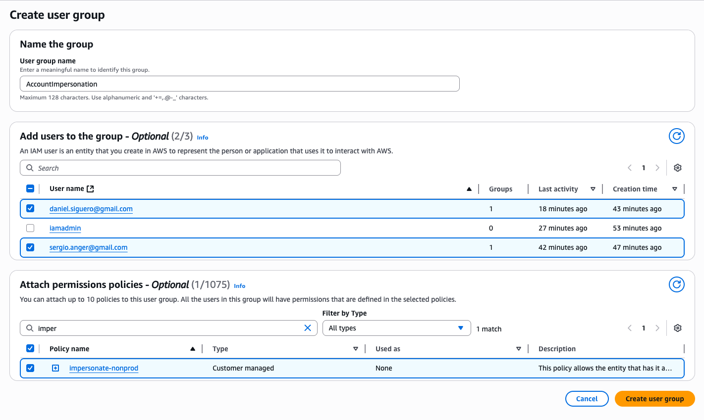

# Glossary

- **Target account(s)**: The accounts that contain the actual AWS resources, the ones we want to impersonate. In our scenario, they are `prod` and `nonprod`.
- **Source account**: The account that will be the single entrypoint in terms of access (and optionally TF remote state). In our scenario, it is `mgmt`.

# Step-by-step

## Target account(s)

### Create IAM Role

We need to create an IAM Role in the Target account(s) that the Source account will impersonate.

1. Log into a Target account (`prod`, `nonprod`).
2. Go to IAM > Roles. Create a role.
3. In `Select trusted entity`, pick `Custom trust policy` as the `Trusted entity type`.
   
4. Ensure the `Trust policy` looks something like this:

   ```json
   {
       "Version": "2012-10-17",
       "Statement": [
           {
               "Effect": "Allow",
               "Principal": {
                   "AWS": [
                       "arn:aws:iam::<AWS_ACCOUNT_ID>:user/<USER_1>",
                       "arn:aws:iam::<AWS_ACCOUNT_ID>:user/<USER_2>",
                       ...
                   ]
               },
               "Action": "sts:AssumeRole",
               "Condition": {
                   "Bool": {
                       "aws:MultiFactorAuthPresent": "true"
                   },
                   "StringEquals": {
                       "sts:RoleSessionName": "${aws:username}"
                   }
               }
           },
           {
               "Effect": "Allow",
               "Principal": {
                   "AWS": [
                       "arn:aws:iam::<AWS_ACCOUNT_ID>:user/<USER_1>",
                       "arn:aws:iam::<AWS_ACCOUNT_ID>:user/<USER_2>"
                       ...
                   ]
               },
               "Action": "sts:AssumeRole",
               "Condition": {
                   "Bool": {
                       "aws:MultiFactorAuthPresent": "true"
                   },
                   "StringLike": {
                       "sts:RoleSessionName": "tofu-layer-0-*"
                   }
               }
           }
       ]
   }
   ```

   Replace `<AWS_ACCOUNT_ID>` and `<USER_#>` accordingly. The first statement covers the AWS CLI, the second statement covers the `layer-0` repository.

5. In the `Add permissions` page, select the desired policies and click `Next`. Because the scope of these steps is for user authentication, we'll select the `AdministratorAccess` policy.
6. In the final step, give the role a name, a description, and ensure that both the `Trust policy` and Permissions make sense. For the name, we've settled on `impersonate-from-mgmt`.



Now do the same on all the Target accounts.

## Source account

### Create IAM Policies

We need to create one policy per Target account so whichever entity has the policy attached, can perform the cross-account `AssumeRole` operation against the Target account.

For better granularity, we've chosen to create as many policies as Target accounts.

Policy JSON example:

```json
{
  "Version": "2012-10-17",
  "Statement": [
    {
      "Effect": "Allow",
      "Action": ["sts:AssumeRole"],
      "Resource": ["arn:aws:iam::<TARGET_AWS_ACCOUNT_ID>:role/impersonate-from-mgmt"]
    }
  ]
}
```



Finally, before creating the policy, give it a name and description.



### Attach policies to IAM Users (via User Group)

After creating the policies, they can be attached to IAM entities. Instead of attaching them directly to each user, we'll create a IAM User Group: `AccountImpersonation`. Then add the named Users to it.



Move onto the next step to configure the `AssumeRole` for AWS Profiles.
