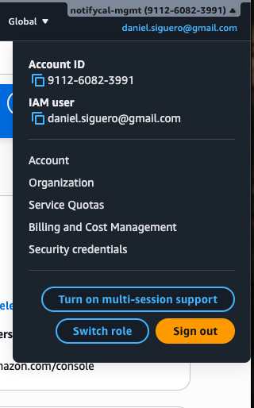
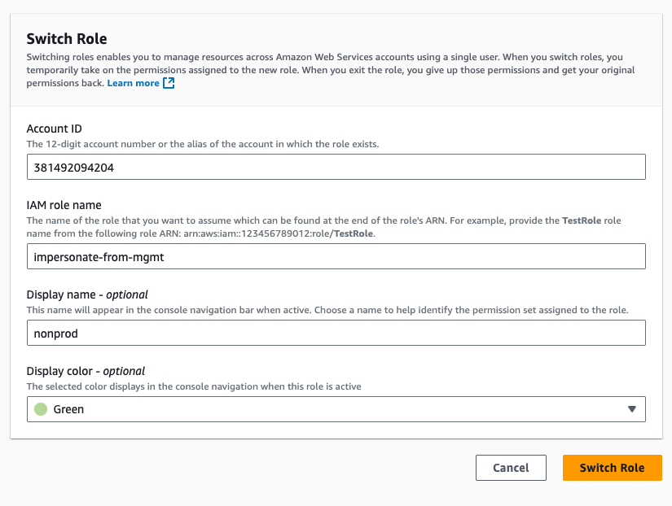
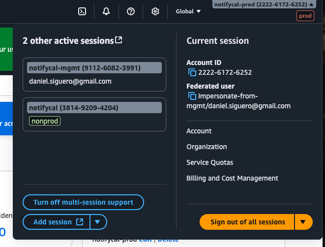

## Using the AWS CLI

This assumes the Source account `AWS_PROFILE` has been successfully setup.

### Edit `~/.aws/credentials` to add Target account(s)

```ini
[notifycal-mgmt-long-term]    # Source account
aws_access_key_id = <secret>
aws_secret_access_key = <secret>

[notifycal-mgmt]    # Source account
<this is automatically filled by the mfa tool>

[notifycal-nonprod]   # Target account
role_arn = arn:aws:iam::<AWS_ACCOUNT_ID>:role/impersonate-from-mgmt
source_profile = notifycal-mgmt
role_session_name = <Your AWS Username>
```

### Test it works

```shell
export AWS_PROFILE=notifycal-mgmt
# do MFA against notifycal-mgmt (Source account)

export AWS_PROFILE=notifycal-nonprod
aws sts get-caller-identity

aws s3 ls   # Should display the S3 buckets in the nonprod (target account)
```

## In the AWS Web console

1. Log into the Source account (`mgmt`) AWS console.
2. Click on the user name in the top-right corner, then click on `Turn on multisession support`.



3. Click on the user name in the top-right corner again, then on the arrow at the right of `Add session`. Finally, click on `Switch role`.
4. In the new screen, fill the following fields, and click on `Switch role`:

- **Account ID**: Target AWS account ID
- **Role name**: The name of the role we want to impersonate: `impersonate-from-mgmt`
- **Display name**: Friendly name that will appear in the selector.
- **Display color**: To quickly identify the different roles/accounts.



5. Repeat steps 3-4 as many times as Target accounts there are. Once done, the multi-session menu should look like this:


