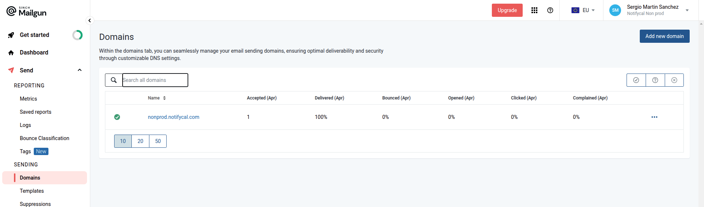
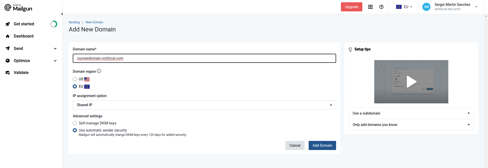
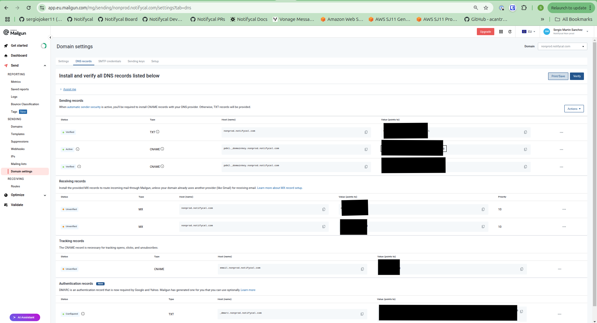

# Mailgun Configuration for Astro

## Overview

This document outlines our email provider setup using Mailgun, including account configurations, security practices, DNS settings, and environment-specific implementation details.

## Why Mailgun?

We have selected Mailgun as our email service provider for the following reasons:

- Professional and mature solution
- Competitive pricing structure
- Generous free tier offering

It's worth noting that the free tier permits only one custom sending domain per account. Additionally, subcounts are not available in lower-priced plans. To maintain separation between production and non-production environments, we've established two distinct Mailgun accounts.

## Account Structure

### Production Account

- **Email**: notifycal@gmail.com
- **Authentication**: [Stored in Bitwarden](https://vault.bitwarden.com/#/vault?itemId=affa63b6-8939-48d8-952c-b2c1009edeff&action=view)
- **Domain**: Not created yet. Account exists but no domain has been created yet. I guess there are 2 options: either notifycal.com or live|prod.notifycal.com

### Non-Production Account

- **Email**: notifycal+nonprodmailgun@gmail.com
- **Authentication**: [Stored in Bitwarden](https://vault.bitwarden.com/#/vault?itemId=7537832e-bbc4-43ef-9d9b-b2c800cb4bd3&action=view)
- **Domain**: nonprod.notifycal.com

## Configuration Process

Follow these steps to configure a Mailgun account for our environments:

1. **Access Mailgun Dashboard and Create a Domain**

   Navigate to the Mailgun dashboard and select the "Domains" section.

   

2. **Complete the Domain Setup Form**

   Fill in the required information as shown below:

   

3. **Configure DNS Records**

   Follow the DNS setup instructions provided by Mailgun:

   

   Add these records to [our Cloudflare DNS settings](https://dash.cloudflare.com/ccd153ef7e11a780f063901f390a3caa/notifycal.com/dns/records).

4. **Verify Domain Configuration**

   After DNS propagation (allow 15-30 minutes), click the "Verify" button in the top right corner of the DNS records page. Alternatively, click the "Unverified/Unconfigured" button under the Status column.

5. **Generate API Key**

   Once verified, create an API key from the domain settings page:

   - For production: https://app.eu.mailgun.com/mg/sending/mail.notifycal.com/settings?tab=keys
   - For non-production: https://app.eu.mailgun.com/mg/sending/nonprod.notifycal.com/settings?tab=keys

   Store this key securely in your environment configuration.

## Environment Configuration

The API keys should be stored in the appropriate environment parameter stores:

`/notifycal/${environment}/providers/mailgun/auth/api-key`

## Security Considerations

- API keys should never be committed to repositories
- Mailgun allegedly will Rotate DKIM keys every 120 days (refer to [Mailgun's official documentation](https://help.mailgun.com/hc/en-us/articles/16956951504539-How-can-I-rotate-my-DKIM-key))

## Additional Resources

- [Mailgun API Documentation](https://documentation.mailgun.com/en/latest/api_reference.html)

## Webhook

Not implemented yet. Emails are being sent in fire and forget fashion due to:

- time constraints
- not being the primary business. In other words, if we weren't able to send emails at this stage, you objectively argue the service is half degraded.

## Observability

Becuase of the fact emails are not a critical part/primary business of Notifycal we agreed on taking a shortcut and relying on vendor responses for metrics and alerting. Therefore, a generic mechanism for all vendors [Implementation](https://github.com/Notifycal/backend/pull/584)
