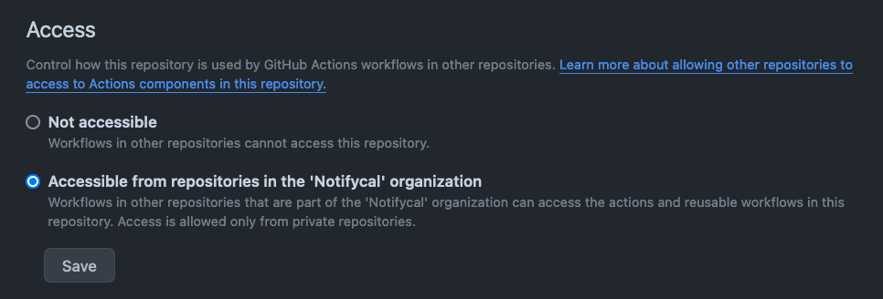

1. Go to the repository settings.
1. Uncheck _Allow merge commits_ and _Allow rebase merging_.
1. Check _Always suggest updating pull request branches_.
1. Check _Automatically delete head branches_.
1. Set _Limit how many branches and tags can be updated in a single push_ to 5.

## Enable Github Actions access from other private repositories in the organziation

Do this if the repo is for example a TF module, or any other sort of repo that we'd want to access
from a Github Action without having to explicitly create and setup a PAT.

## Ensure the repository has access to the secrets it needs

Because we aren't using a paid Github Organization, we cannot define Organization-level secrets that can be reused across all the repositories. This means whenever we create a new repo, we need to ensure it has all the relevant secrets. Depending on the type of the repo, it will require more or less secrets.

Rather than doing this manually, we have `layer-0/ci` which handles this secret creation automatically (but we have to run it!).

### For ALL repos

- `NOTIFYCAL_CICD_APP_ID` & `NOTIFYCAL_CICD_APP_SECRET`: We use these 2 to obtain short-lived Github tokens with more permissions than the default token associated to an action.

As soon as a repo is created within the Github Organization, and we run `tofu apply` against `layer-0/ci`, it will be able to access these secrets.

### Deployable repos

For deployable repos (through TF or TG), we need the above 2, and also:

- `AWS_IAM_ROLE_CI`: AWS IAM Role that Github Actions assumes when interacting with our AWS account.
- `CLOUDFLARE_API_TOKEN`: Cloudflare API token for interacting with our Cloudflare account.

For these deployable repos, we have to manually add them to the `include_repos` TF local in `layer-0/ci`. Then `tofu apply`.

## Add add-issue-to-project-reusable workflow

We want issues created within an Organization repository to end up in the default (and only) Notifycal Github Project. In a similar fashion than with Organization secrets, we'd have to pay for Github if we wanted this to happen automatically.

But we can achieve the same outcome by calling a reusable workflow that does this, from each repo.

Check [this link](https://github.com/Notifycal/gh-actions#add-issues-to-projectyaml) to learn more.
