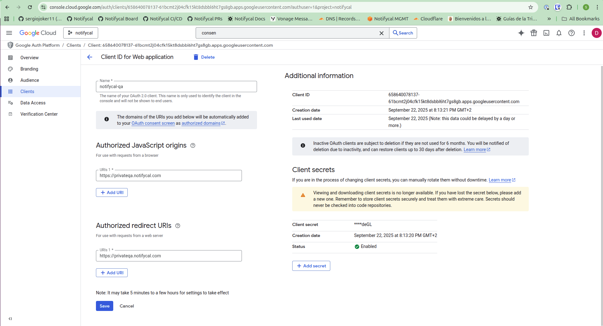

## Overview

This document provides a comprehensive guide for creating new environments in the Notifycal infrastructure. The process involves generating the IaC configuration, obtaining and configuring provider secrets, and applying the necessary components to instantiate the new environment.

## Prerequisites

- Access to the **environments** repository
- Access credentials for all 6 providers -> BitWarden
- AWS CLI configured for the target account

## Step-by-Step Process

### [Optional] Step 0: AWS Account

If you desire to separate environments with a solid wall you might want a separate AWS account. For us, prod env uses a separate account.

Refer to the comprehensive AWS multi-account setup documentation:

- [Multi-Account Overview](<../AWS/Multi-account\ setup/00_multi_account_overview.md>)
- [AWS Account Setup](<../AWS/Multi-account\ setup/10_aws_account_setup.md>)

### Step 1: Prepare Base Environment

1. Navigate to the **environments** repository
2. Go to the `envs/` directory
3. **Copy the prod folder** as the base template
   - Production is the most stable and up-to-date environment
   - This ensures any production issues are inherited by the new environment and magnifies the chances of reproducing it in the new environment.
4. Rename the copied folder to your new environment name (e.g., `staging`, `dev`, `qa`)

```bash
cd environments/envs/
cp -r prod/ ${newEnv}/
cd ${newEnv}
```

### Step 2: Critical Cleanup

#### Clear Cache Directories

**⚠️ CRITICAL**: Delete all cache folders to prevent conflicts

```bash
find ${newEnv}/ -name ".terragrunt-cache" -type d -exec rm -rf {} +
find ${newEnv}/ -name ".terraform.lock.hcl" -type d -exec rm -rf {} +
```

#### Clean Input Configurations

1. Go through **all** `terragrunt.hcl` files in the new environment
2. Update environment-specific inputs:
   - Environment name. Important: update environment name in env.json
   - Domain configurations
   - Region settings (if applicable)
   - Any environment-specific parameters

### Step 3: Configure Secrets

Navigate to the **env_secrets** stack in your new environment folder. This stack contains a local secret.auto.tfvars file with all provider secrets that **must** be replaced for the new environment.

The secrets configuration will force you to go through all 6 provider configurations:

### Step 4: Provider Configuration

Configure the following 6 providers (secrets replacement will guide you through each):

#### Providers with Existing Documentation

1. **Vonage (SMS)**
   - Follow: [Vonage Manual Configuration](../../sms/01_manual_configuration)
   - Configure application, keys, and webhook URLs

2. **Mailgun (Email)**
   - Follow: [Mailgun Setup Guide](../../email/00_mailgun)
   - Configure domain, API keys, and DNS records

3. **Stripe (Payments)**
   - Follow: [Stripe README](https://github.com/Notifycal/backend/blob/409dcfa53b1c6e07fdafb0c3d506fb6b0d709dbe/tf/stripe.README.md)
   - Configure API keys and customer portal config - Note: There is [an open and accepted issue](https://github.com/lukasaron/terraform-provider-stripe/issues/91) requesting the feature in the terraform provider.

4. **Stripe Admin Webhook (Slack Notifications)**
   Configure admin webhook integrations. "admin" being events such as: open dispute, new customer, failed payment, etc..
   - Follow [this link](https://notifycal.slack.com/marketplace/A0F81FNVC-stripe)
   - Click on "Add to slack" and add a new configuration.
   - Grab the URL generated and paste it in the new secret.auto.tfvars

5. **Google Cloud (OAuth)**
   Having previously setup the project OAuth Consent, a new client will inherit some required properties. The remaninng steps are:
   - Go to Google Cloud console being logged in with notifycal@gmail.com using [this link](https://console.cloud.google.com/auth/clients?authuser=1&project=notifycal)
   - Set a name, Authorized JavaScript origins and Authorized redirect URIs like in the screenshot below
   - Grab the client ID and client secret generated and paste it in the new secret.auto.tfvars

   

6. **Google Tag Manager**
   - Follow: [Analytics guide](../../website/analytics/20_analytics/)
   - Set GTM id in the new secret.auto.tfvars

### Step 5: Environment Instantiation

After configuring all providers and secrets, instantiate the environment using the AWS account of your choice:

#### Required Local Apply

You **must** apply these components locally firstbefore handing off the environment to the CI/CD system:

```bash
# PWD: environments/envs/${newEnv}/env_secrets/
terragrunt apply

# PWD: environments/envs/${newEnv}/payment-plans/
terragrunt apply
```

**Purpose**: These local applies force the creation of the S3 remote state bucket and essential infrastructure.
**Result**: Once successful, CI/CD can take responsibility for managing the rest of the environment.

#### CI/CD Handoff

After the local components are applied:

1. Push your changes to the repository
2. CI/CD pipeline should handle remaining infrastructure deployment
3. Monitor the pipeline for any issues

## Security Notes

- Never commit secrets to the repository
- Use parameter store for all sensitive configuration
- Rotate credentials periodically
- Monitor access logs for unusual activity
- Ensure least-privilege access for service accounts
