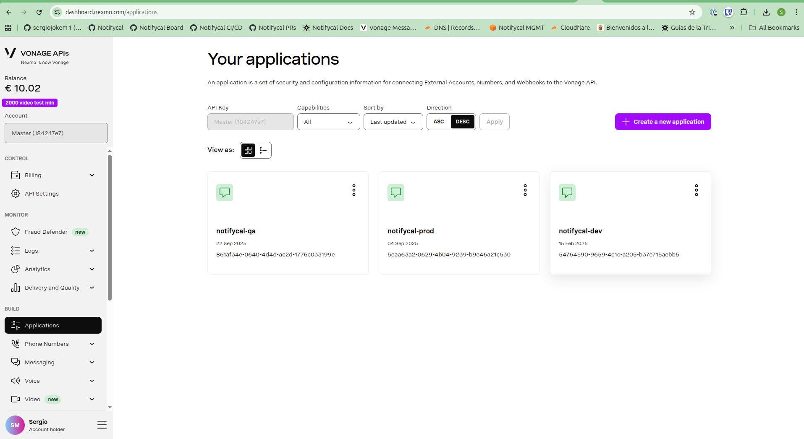
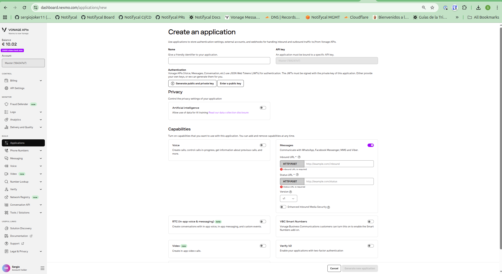
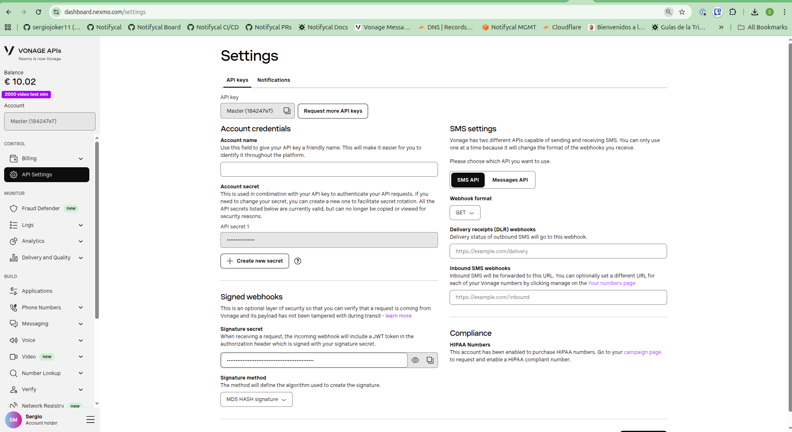

## Overview

This document provides detailed instructions for manually configuring Vonage (Nexmo dashboard) for SMS integration in a new environment. This process involves creating applications, managing authentication keys, and configuring webhook endpoints.

## Prerequisites

- Access to Vonage dashboard (Nexmo interface). Credentials in Bitwarden.
- Knowledge of target environment domain
- Access to Terragrunt configuration. Environments repo.

## Configuration Process

### 1. Access Vonage Dashboard

Navigate to the Vonage portal using the Nexmo dashboard interface.

**URL**: [Vonage Dashboard](https://dashboard.nexmo.com/)



### 2. Create New Application

1. Navigate to the Applications section in the dashboard
2. Click "Create a new application"
3. Fill in the application details as shown below:



#### Application Configuration

**Required fields:**
- **Application Name**: Use descriptive naming (e.g., `notifycal-{environment}`)
- **Authentication**: Configure public/private key pair (see next section)

### 3. Authentication Setup

#### Public/Private Key Configuration

You have two options for authentication:

**Option A: Generate new key pair**
- Let Vonage generate a public/private key pair automatically
- Download and securely store the private key

**Option B: Provide existing key pair**
- Upload your existing public key
- Ensure you have the corresponding private key securely stored

*Note: This uses symmetric cryptography for secure communication*

### 4. Enable Messages API

1. In the application settings, enable the "Messages API"
2. Configure the required webhook URLs:

**Inbound URL:**
```
https://api{environment}.notifycal.com/webhook/vonage/inbound
```

**Status URL:**
```
https://api{environment}.notifycal.com/webhook/vonage/status
```

**Examples:**
- Production: `https://api.notifycal.com/webhook/vonage/inbound`
- Dev: `https://apidev.notifycal.com/webhook/vonage/inbound`

#### API Configuration Settings

- **Version**: v1
- **Enhanced inbound media security**: Disabled (not required)

### 5. API Settings Configuration

Once the application is created, navigate to the API Settings section to retrieve shared credentials.



#### Required Credentials

From the API Settings panel, you'll need to collect:

1. **API Key** (shared across all applications). IMPORTANT: Confusingly enough, this is not a secret, we have been told.
2. **Webhook JWT Signing Secret** (shared across all environments)

### 6. Credential Collection

After completing the configuration, collect the following values for Terragrunt integration:

#### Application-Specific Credentials
- **Application ID**: Generated when application is created
- **Private Key**: Downloaded during key pair generation
- **Public Key**: Used for authentication setup

#### Shared Credentials
- **API Key**: Found in API Settings
- **Webhook JWT Signing Secret**: Found in API Settings

### 7. Terragrunt Integration

Transfer the collected credentials to your Terragrunt configuration.

## Security Considerations

- **Private keys**: Never commit to repositories, store securely
- **JWT secrets**: Sadly, it is shared across environments. Should be rotated periodically
- **Webhook URLs**: Ensure HTTPS endpoints only

## Troubleshooting

- **Authentication issues**: Verify public/private key pair matching
- **Webhook delivery failures**: Check endpoint availability and HTTPS configuration
- **API rate limits**: Monitor usage through Vonage dashboard

## Additional Resources

- [Vonage Messages API Documentation](https://developer.vonage.com/en/messages/overview)
- [Vonage Webhook Documentation](https://developer.vonage.com/en/getting-started/concepts/webhooks?lang=messages)