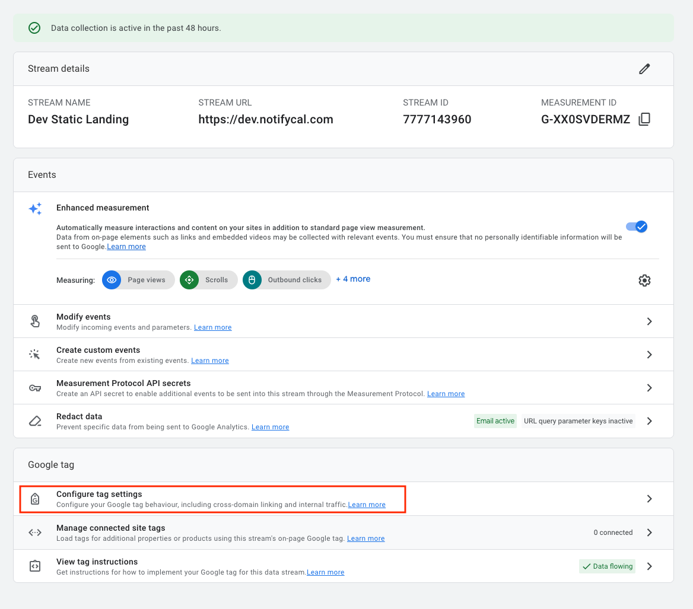
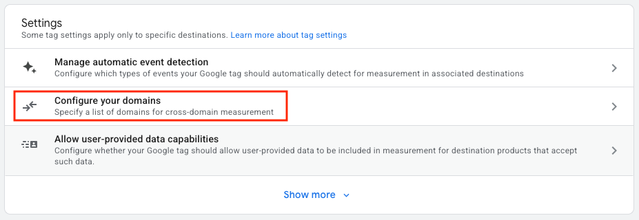
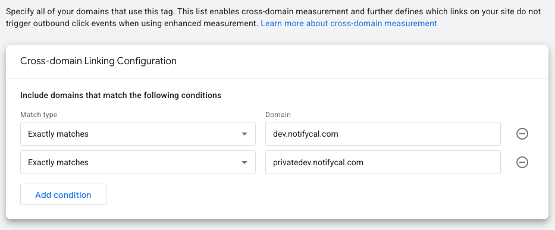

In Google Analytics 4 (GA4), the tracking structure is organized into three levels: **Account**, **Property**, and **Data Stream**. Your Google Analytics account can contain multiple properties. Each **property represents a single product or business area**, and within each property you create one or more data streams — for example, a web data stream for your website or an app stream for your mobile app. To measure several domains or URLs together, you normally add them under the same web data stream (and configure cross-domain measurement if needed). If you prefer to keep their data separate, you can instead create a separate property or stream for each.

## One property per page vs multiple data streams per property vs single stream with cross-domain measurement

In GA4, the recommended setup for related websites (for example a public landing page and a private area under the same brand or environment) is to use **one property** with a **single web data stream** so that user sessions, conversions and attribution remain consistent across domains. If the sites live on different domains, **enable cross-domain measurement in that stream** rather than creating additional web streams. Only create a separate web data stream or property if the sites are truly independent projects with different tagging, consent, or privacy requirements.

The main drawback of using a **separate property** for each page in GA4 is that **data isn’t shared across properties**. Each property generates its own user IDs and sessions, so you **lose the ability to see a single user’s journey** from the landing page to the private area. Conversions and attribution get fragmented, audiences can’t span both properties, and you have to duplicate events, conversions, and integrations in each one. To combine the data you’d need to export both properties (e.g. to BigQuery) and join them yourself. In short, **separate properties break user- and session-level continuity** unless the sites are truly independent.

## Create a GA4 Property/App

TODO

## Add page to analytics

Assuming the Property/App and Data Stream have already been setup:

1. Go to the [Google Analytics homepage](https://analytics.google.com/).
2. In the top left menu, select the **Account** and **Property** for the environment.
3. At the bottom left corner, click on **Admin** (cog wheel icon).
4. Find **Data streams** and click on it. Click on the current Data stream.
5. Click on **Configure tag settings**.

   

6. In the new window, click on **Settings** > **Configure your domains**.

   

7. Add all the domains that need to be tracked in the same Data stream (static page and private area).

   
