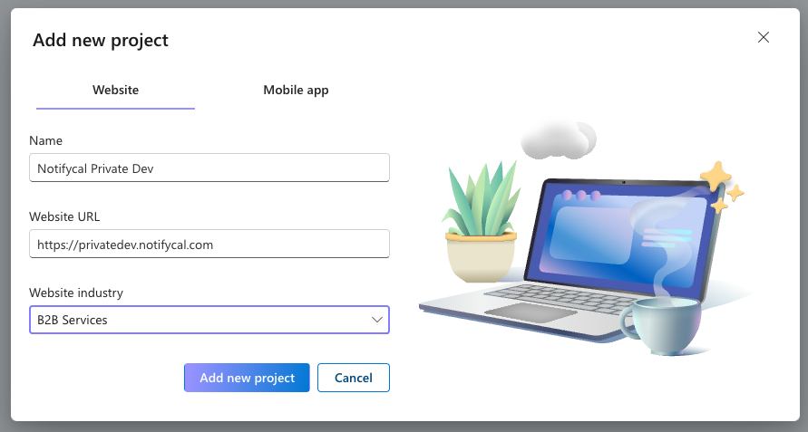

Microsoft Clarity uses a very simple structure: each Project corresponds to one website or domain and there is no hierarchy of accounts, properties, or data streams like in GA4. You add the Clarity tracking code for a specific project to the pages you want to monitor, and all heatmaps, recordings, and metrics for those pages appear in that project’s dashboard. If you want to track multiple websites or domains separately, you create a separate project for each.

## Create a project

1. Go to [Projects](https://clarity.microsoft.com/projects).
2. Click on **New Project**. Select **Website** type.
3. Fill the project details.

   

4. Copy/write down the Microsoft Clarity ID from the project URL, to set it up later in Google Tag Manager.
   ```
   https://clarity.microsoft.com/projects/view/<Clarity_ID>/settings#overview
   ```
