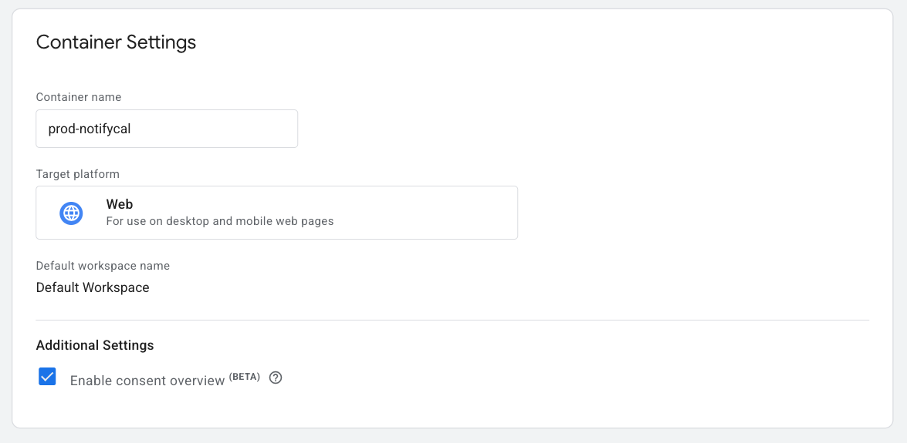
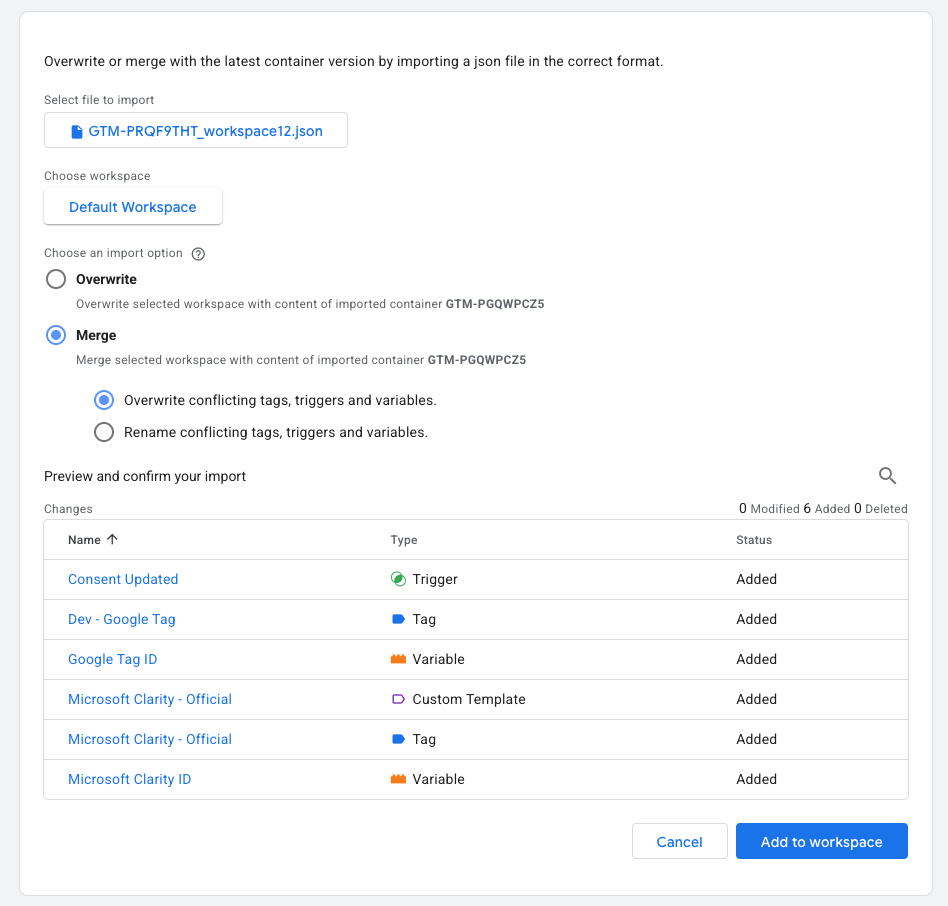

## Create new account

TODO

## Create new container

A container is meant to hold data for a whole environment as long as consent/tags/etc are the same (or configured to cater for multiple sites).

1. Go to [Google Tag Manager](https://tagmanager.google.com). Then **All accounts**. You'll see a list of containers.
2. In the top right corner, click the 3 dots and select **Create container**.
3. Set the page URL as **Container name**. Select **Web** as the **Target platform**.
4. Click **Create** on the top right corner of the page.
5. You'll then see the GTM setup scripts.
   - One for when JS is enabled. It's meant to go in the HTML `<head>`.
   - One for when JS is disabled (noscript). It's meant to go at the beginning of the HTML `<body>`.

---

## Enable Consent Overview (beta)

1. Access the container.
2. Go to the **Admin** tab.
3. On the right column, select **Container Settings**.
4. Under **Additional Settings**, enable **Enable consent overview**.

   

## Import template into container

1. Access the container.
2. Go to the **Admin** tab.
3. On the right column (Container), select **Import Container**.
4. Select the .json file. <a href="/files/gtm_container.json" download>Download JSON</a>.
5. Choose the **Default Workspace**.
6. On **Choose an import option** select **Merge** and **Overwrite conflicting tags, triggers and variables**.

   

7. Go to **Workspace** > **Variables** and in **User-Defined Variables** set the right values for the following entries:

- **Google Tag ID**
- **Microsoft Clarity ID**
